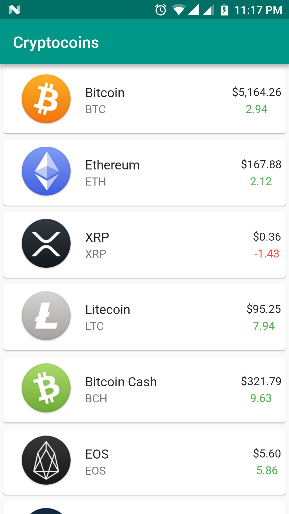

# Cryptocoins
------

Cryptocoins  is a mobile application showcasing the top 100 cryptocurrencies, their pricing and changes with pull to refresh feature.

**Note**: This app was initially made for #FlutterCreate, a contest by Google that challenges developers to build a beautiful Flutter app using 5KB or less of Dart code.
Find out more about #FlutterCreate here: https://flutter.dev/create

## Screenshot


## Built With
[Flutter](https://flutter.dev/)

## Packages
* [http](https://pub.dartlang.org/packages/http)
* [intl](https://pub.dartlang.org/packages/intl)

## Icon
* [cryptoicons.co](http://cryptoicons.co/)

## Api
* [coinranking api](https://docs.coinranking.com/public)

## Download & install
First, clone the repository with the 'clone' command, or just download the zip.

```
$ git clone git@github.com:waiphyohan/cryptocoins.git
```

Then, download either Android Studio or Visual Studio Code, with their respective [Flutter editor plugins](https://flutter.io/get-started/editor/). For more information about Flutter installation procedure, check the [official install guide](https://flutter.io/get-started/install/).

Install dependencies from pubspec.yaml by running `flutter packages get` from the project root (see [using packages documentation](https://flutter.io/using-packages/#adding-a-package-dependency-to-an-app) for details and how to do this in the editor).

There you go, you can now open & edit the project. Enjoy!

## Developed By
Wai Phyo Han [Github](https://github.com/waiphyohan), [Twitter](https://twitter.com/waiphyohan)

## License
Cryptocoins is released under the MIT License
